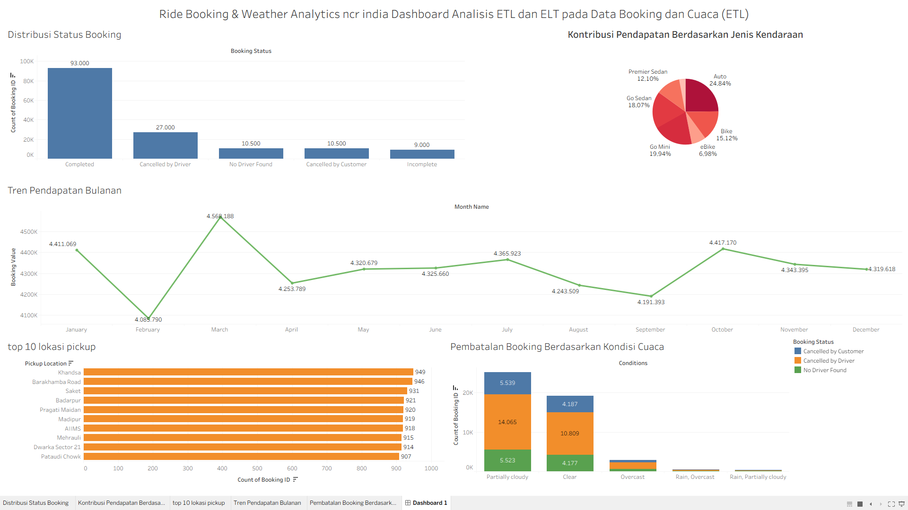
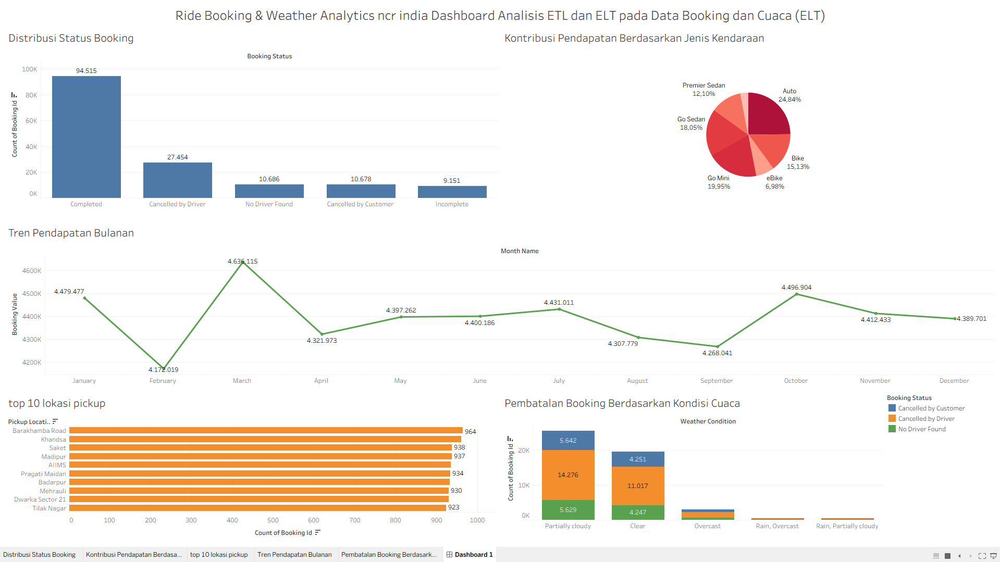

# 📊 Panduan Dashboard Analitik Tableau

Folder ini berisi file visualisasi data Tableau Desktop (`.twb`) dan dokumentasi petunjuk untuk menghubungkan visualisasi tersebut ke database cloud Supabase PostgreSQL.

---

## 🔑 Kredensial Database Supabase

Untuk menghubungkan Tableau ke database atau ketika Tableau meminta kata sandi database, gunakan informasi berikut:

| Parameter | Nilai |
| :--- | :--- |
| **Server / Host** | `db.okculcsrmwiactymkqzq.supabase.co` |
| **Port** | `5432` |
| **Database** | `postgres` |
| **Username** | `postgres` |
| **Password** | `uas_bigdata2026` |
| **Authentication** | Username and Password |

---

## 🌐 Prasyarat Jaringan (PENTING)

> [!WARNING]
> **Penting untuk Jaringan Kampus:**
> - Jika Anda menggunakan **WiFi Kampus** (atau jaringan lain yang memblokir port `5432`), Anda **wajib mengaktifkan Cloudflare WARP** atau VPN sebelum membuka Tableau. Jika tidak, Tableau tidak akan bisa terhubung ke server database.
> - Jika menggunakan jaringan seluler (tethering) atau WiFi rumah, Anda dapat langsung menghubungkannya secara normal tanpa VPN.

---

## 📥 Download & Instalasi Driver PostgreSQL untuk Tableau

Jika Anda baru pertama kali menghubungkan Tableau ke PostgreSQL dan mendapatkan error *Driver missing*, Anda harus menginstal driver PostgreSQL terlebih dahulu.

### Cara Instalasi Driver (Windows):

1. **Unduh Driver JDBC PostgreSQL**:
   - Buka halaman resmi download driver JDBC PostgreSQL: [PostgreSQL JDBC Download](https://jdbc.postgresql.org/download/).
   - Unduh versi terbaru (file `.jar`), contohnya: `postgresql-42.7.3.jar`.
2. **Pindahkan File Driver**:
   - Pindahkan file `.jar` yang baru diunduh ke direktori driver Tableau:
     ```text
     C:\Program Files\Tableau\Drivers
     ```
     *(Catatan: Jika folder `Drivers` tidak ada di dalam folder `Tableau`, buat folder baru dengan nama tersebut).*
   - **Panduan Visual**:
     
3. **Restart Tableau**:
   - Tutup Tableau Desktop jika sedang terbuka, lalu buka kembali agar driver baru terdeteksi.

> [!TIP]
> Anda juga dapat mengunduh driver resmi PostgreSQL lainnya (seperti installer ODBC `.msi`) secara langsung melalui halaman resmi [Tableau Driver Download Page](https://www.tableau.com/support/drivers) dengan memilih opsi **PostgreSQL**.

---

## 🛠️ Cara Membuka dan Menghubungkan Dashboard di Tableau

Ikuti langkah-langkah di bawah ini untuk membuka dashboard Tableau yang ada di folder ini:

### Langkah 1: Buka File `.twb`
Pilih dan buka salah satu file dashboard sesuai proses data yang ingin Anda lihat:
- **[etl_terbaru.twb](etl_terbaru.twb)**: Dashboard visualisasi hasil dari proses ETL.
- **[elt_terbaru.twb](elt_terbaru.twb)**: Dashboard visualisasi hasil dari proses ELT.

### Langkah 2: Masukkan Kredensial Koneksi
1. Saat file dibuka, Tableau akan mendeteksi koneksi PostgreSQL dan meminta kata sandi.
2. Masukkan password database: **`uas_bigdata2026`**.
3. Pastikan kolom Host terisi: **`db.okculcsrmwiactymkqzq.supabase.co`** dan Username: **`postgres`**.
4. Klik **Sign In** / **Masuk**.

### Langkah 3: Verifikasi Sumber Data (Data Source)
- Jika Tableau meminta lokasi tabel atau jika data tidak muncul otomatis, pastikan skema yang dipilih adalah **`public`**.
- Untuk **ETL Dashboard**, tabel sumber data yang digunakan adalah `ride_bookings_weather_merged`.
- Untuk **ELT Dashboard**, tabel sumber data yang digunakan adalah `fact_ride_weather` (tabel fakta hasil pemrosesan di database).

---

## 🖼️ Tampilan Dashboard

Berikut adalah preview visualisasi dashboard analitik yang telah dibuat:

### 1. Dashboard ETL


### 2. Dashboard ELT

